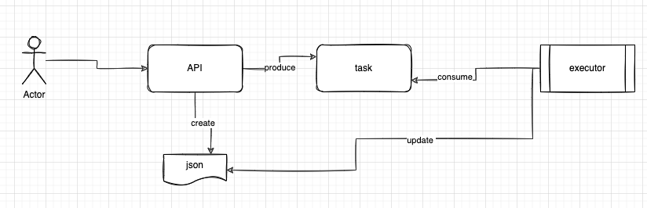
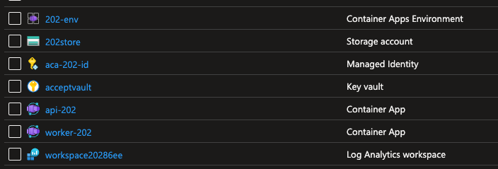

# Implementing a 202 pattern with Azure Container Apps

The 202 pattern is a design pattern that is used to handle requests that may take a long time to complete. It involves returning a 202 Accepted response to the client, indicating that the request has been accepted and is being processed asynchronously. The client can then poll the server for the status of the request using a separate API.

This pattern can be used in scenarios where the request processing time may vary significantly, or where the client does not need to wait for the request to complete before performing other tasks. It can also be used to decouple the client from the server, allowing the client to continue processing without being blocked by the server.

The 202 pattern is commonly used in distributed systems, where the client and server may be running on different machines or in different locations. It can also be useful in microservices architectures, where different services may need to communicate with each other to complete a request.

There are several benefits to using Azure Container Apps for implementing the 202 pattern:

- Scalability: Azure Container Apps can scale automatically based on workload, making it easier to handle a large number of requests concurrently.

- Reliability: Azure Container Apps are designed to be highly available and resilient, with features such as auto-restart and self-healing capabilities.

- Integration: Azure Container Apps can easily integrate with other Azure services, such as Azure Functions and Azure Queue Storage, to build a more powerful and flexible solution.

- Monitoring: Azure Container Apps come with built-in monitoring and logging capabilities, allowing you to track the status of your requests and troubleshoot any issues that may arise.

- Flexibility: Azure Container Apps support a wide range of languages and frameworks, making it easy to build solutions using the tools and technologies you are most familiar with.

Overall, Azure Container Apps can be a powerful and flexible platform for implementing the 202 pattern, providing scalability, reliability, integration, monitoring, and flexibility to your solution.

__Ok, so What would be covered?__

- High level solution overview of the 202 pattern using Azure Container Apps

- What would it take to leverage this sample and implement the 202 pattern

## High level solution overview

The 202 pattern involves the following steps:

1. The client sends a request to the server, indicating that it wants to perform some action.

2. The server accepts the request and returns a 202 Accepted response to the client, together with a resource url that can be used to poll the server for the status of the request.

3. The client polls the server for the status of the request using a separate API.

### Using Container Apps as the Api Server

The initial template for this project was the .NET Core 6 Web API template. It was modified to include a new controller called TaskController, which is responsible for handling requests and returning a 202 Accepted response to the client. The controller uses a model called TaskRequest to represent the request sent by the client. When a request is received, the TaskController creates a new task and returns a 202 Accepted response to the client, along with a resource URL. This URL can be used to poll the server for the status of the request. To represent the task, the controller creates a blob in Azure Storage and returns the URL of the blob as the resource URL. Finally, the controller sends a message to an Azure Storage Queue, which contains a JSON representation of the TaskRequest model.

The connection string for the storage account is stored in Azure Key Vault, which can be accessed by the application using managed identity. The application is deployed to Azure Container Apps, which is configured to use the name of the Key Vault as an environment variable. To allow the container app to access the Key Vault, the identity of the container app must be set with an identity that has the `Secret User` role on the Key Vault. This will allow the application to retrieve the connection string from the Key Vault and use it to connect to the storage account.

Scaling rule were not changed, and the default scaling rule is used. This means that the container app will scale up to 10 instances based on the number of Http requests. The container app will scale down to 0 instance after 5 minutes of inactivity.

### Using Container Apps as the Worker

The worker is a .NET Core 6 console application that processes messages from an Azure Storage Queue. When a message is received, the worker retrieves the JSON representation of the TaskRequest model from the message and uses it to update the status of the task in a blob stored in Azure Storage. The blob contains a JSON representation of the TaskStatus model, which is used to track the progress of the task. The TaskRequest model has a status property that can be updated to indicate the current status of the task, such as `Processing`, `Completed`, or `Failed`.

This code provides a simple example of how the worker can be used to process messages from the Azure Storage Queue. In a real-world scenario, the worker would be responsible for performing the actual work required to complete the task. For example, the worker could be used to process a large file or perform a long-running calculation.

The worker is also making similar use of Azure Key Vault as the Api Server. As the base class differ (HostBuilder vs WebHostBuilder), the implementation is slightly different. 

It is important to remove messages from the Azure Storage Queue after they have been processed, whether the task was successful or not. If the message is not removed, it could cause the task to be processed repeatedly, leading to an infinite loop of failures. To avoid this scenario, it is best to remove the message from the queue after it has been processed, regardless of the outcome. This will ensure that the task is not processed multiple times, and will help prevent any potential issues with the processing of the task.

Created an Azure Queue scaling rule, which will ensure that the worker is scaled up to 10 instances when there are messages in the queue. The scaling rule will scale down to 0 instances after 5 minutes of inactivity.

### Models - class libarary

To ensure that both the Api Server and Worker have access to the same models, it was decided to create a class library to hold the models. This will allow any changes made to the models to be reflected in both the Api Server and Worker. Working with .NET Core packages is well documented in the official [official documentation](https://docs.microsoft.com/en-us/nuget/quickstart/create-and-publish-a-package-using-the-dotnet-cli), including instructions for creating and publishing a package using the .NET CLI. This can be helpful when creating and distributing your own packages, such as the class library containing the models.

## Implementing the 202 pattern - your way

This sample demonstrates how the 202 pattern can be implemented using Azure Container Apps. It provides a basic example that can serve as a starting point for building your own solution, and can be used as a reference for implementing the 202 pattern in your own applications.

The sample uses Azure Storage Queue as the middleware for tasks due to its cost-effectiveness. Other mechanisms, such as Azure Service Bus, Azure Event Grid, and Azure Event Hub, could also be used. Similarly, the sample uses Azure Storage as the persistence layer for the task status due to its cost-effectiveness. Other options, such as Azure SQL and Azure Cosmos DB, could also be considered. Ultimately, the choice of middleware and persistence layer will depend on the specific needs and requirements of your solution.

### Step by step

1. Create the following resources in your Azure subscription:

2. Clone the repository and open the solution in VS Code.

3. The code contains 3 projects:

    - The Api Server project contains the code for the Api Server. The Api Server is responsible for accepting requests from the client and returning a 202 Accepted response to the client, along with a resource URL that can be used to poll the server for the status of the request.

    - The Worker project contains the code for the Worker. The Worker is responsible for processing messages from an Azure Storage Queue and updating the status of the task in a blob stored in Azure Storage.

    - The Models project contains the models used by the Api Server and Worker. This project is a class library that is referenced by both the Api Server and Worker projects.

4. You can customize each project to meet your specific needs. For example, you can add additional properties to the TaskRequest and TaskStatus models, or add additional logic to the Worker to perform the actual work required to complete the task. You can also add additional controllers to the Api Server to handle additional requests, for example if you need another middleware such as Azure Service Bus, you could add another controller to address this need.

5. In the case the `models` project, you can publish the package to a NuGet feed. This will allow you to reference the package in the Api Server and Worker projects. This will ensure that any changes made to the models are reflected in both the Api Server and Worker projects.

